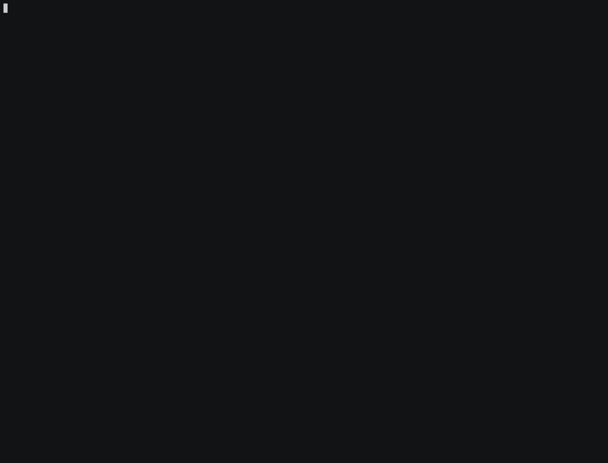

# docker.vim
This is management plugin for docker.



# Features
## images
- image list(udpate every 5 second)
- delete image
- pull image
- search image

## containers
- container list(udpate every 5 second)
- start/stop/restart/kill container
- delete container
- attach container(require docker command)
- monitoring container logs and CPU/MEM

# Requirements
- curl >= 7.40.0
- Vim version >= 8.1.1799
- docker command

# Installation
ex dein.vim
```toml
[[plugins]]
repo = 'skanehira/docker.vim'
```

# Usage
## commands
images
```vim
:DockerImages
```

pull image
```vim
:DockerImagePull
```

conatiners
```vim
:DockerContainers
```

monitor container
```vim
" start monitor
:DockerMonitorStart {id or name}

" stop monitor
:DockerMonitorStop
```

monitor window move
```vim
:DockerMonitorWindowMove
```

monitoring container logs
```vim
" if contaienr is not running, terminal does not close automatically
:DockerContainerLogs {id or name}
```

show version info
```vim
:DockerVersion
```

## key bindings
common operation

| operation          | key |
|--------------------|-----|
| scroll to top      | 0   |
| scroll to bottom   | G   |
| close popup window | q   |

containers

| operation                             | key    |
|---------------------------------------|--------|
| start container                       | u      |
| stop container                        | s      |
| restart container                     | r      |
| refresh containers                    | R      |
| kill container                        | K      |
| attach container                      | a      |
| monitor container's cpu nad mem usage | a      |
| delete container                      | ctrl-d |
| rename container                      | ctrl-r |
| monitoring container logs             | l      |

images

| operation        | key    |
|------------------|--------|
| refresh images   | R      |
| delete image     | ctrl-d |

search images

| operation                 | key |
|---------------------------|-----|
| pull image                | p   |
| open DockerHub in browser | o   |
